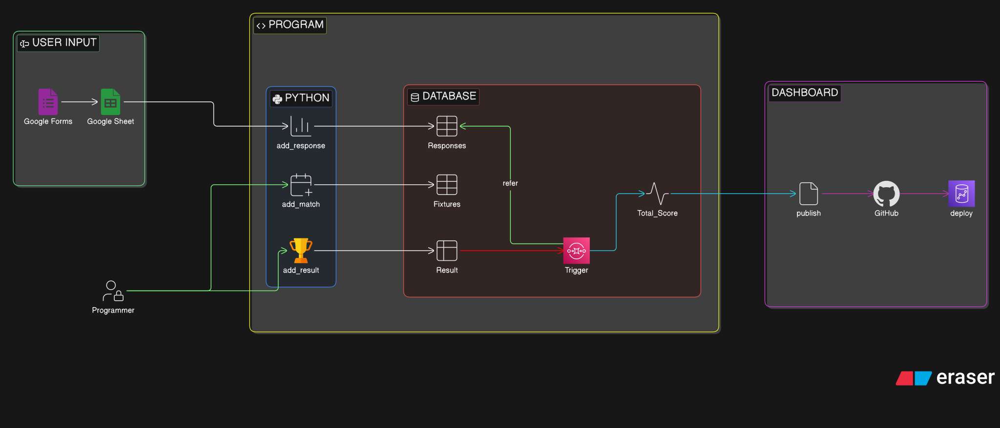
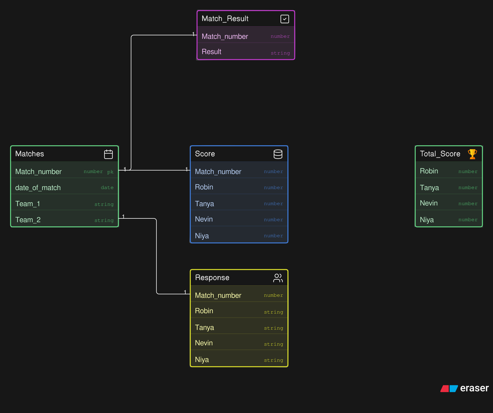

# fifa-family-predictor
A personal automation project for managing a family FIFA prediction game. The system collects predictions, tracks match results, calculates scores automatically, and publishes a live leaderboard through GitHub Pages.

## System Architecture:
<div align="center">
    
    <p><em>System Architecture</em></p>
</div>

## Database Architecture
<div align="center">
    
    <p><em>Database Architecture</em></p>
</div>

## Workflow: 
See the workflow of the system: 
- [Google Forms to Database](docs/forms_to_database.md)
- [Inserting Result and the Trigger in action](docs/triggering.md)
- [Path of Deployment](docs/publishing.md)

## Repo Structure:
```txt
.
├── docs
│   ├── forms_to_database.md
│   ├── publishing.md
│   ├── README.md
│   └── triggering.md
├── Images
│   ├── database_diagram.svg
│   └── system_architecture.svg
├── index.html
├── README.md
├── requirements.txt
├── sql
│   ├── procedure.sql
│   ├── table_schema.sql
│   └── triggers.sql
└── src
    ├── add_match.py
    ├── add_response.py
    ├── add_result.py
    ├── generate_dashboard.py
    ├── __init__.py
    └── publish_result.py
```
## Technologies:
- Python
- MySQL
- Google Forms
- Google Sheets
- Github Pages