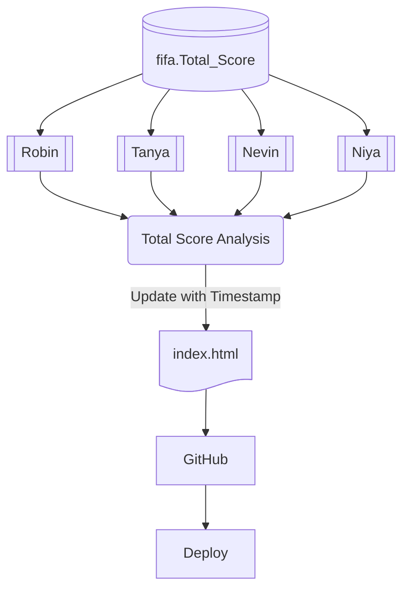

# `publish_result.py` to GitHub Pages:

```mermaid
flowchart TD
    db["fifa.Total_Score"]@{shape: lin-cyl}
    rob["Robin"]@{shape: fr-rect}
    tan["Tanya"]@{shape: fr-rect}
    nev["Nevin"]@{shape: fr-rect}
    niya["Niya"]@{shape: fr-rect}
    db --> rob
    db --> tan
    db --> nev
    db --> niya
    analysis["Total Score Analysis"]@{shape: rounded}
    rob --> analysis
    tan --> analysis
    nev --> analysis
    niya --> analysis
    file["index.html"]@{shape: doc}
    analysis --> |Update with Timestamp| file
    github["GitHub"]
    deploy["Deploy"]
    file --> github
    github --> deploy
```