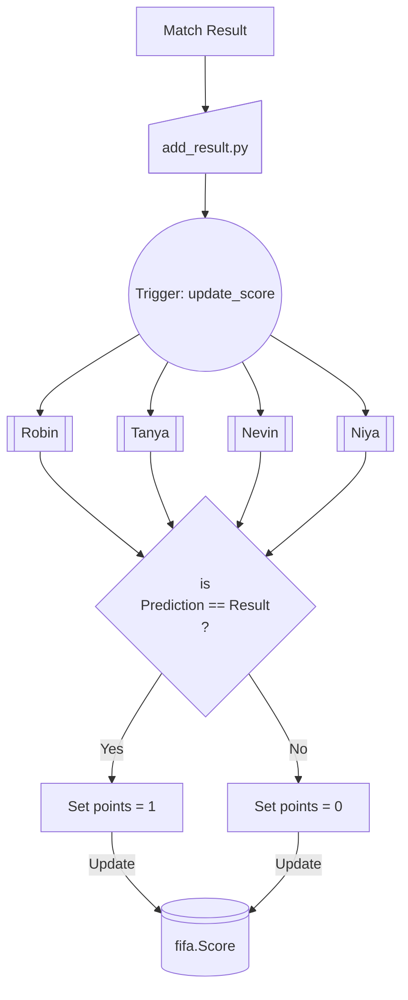

# Updation of fifa.Match_Result and Triggerring Updation on fifa.Score

```mermaid
flowchart TD
    res["Match Result"] --> add_res["add_result.py"]@{shape: sl-rect}
    add_res --> trig["Trigger: update_score"]@{shape: circle}
    trig --> robin["Robin"]@{shape: fr-rect}
    trig --> tanya["Tanya"]@{shape: fr-rect}
    trig --> nevin["Nevin"]@{shape: fr-rect}
    trig --> niya["Niya"]@{shape: fr-rect}

    robin --> decision["is \nPrediction == Result\n?"]@{shape: diamond}
    tanya --> decision
    nevin --> decision
    niya --> decision
    decision -->|Yes| correct["Set points = 1"]
    decision -->|No| wrong["Set points = 0"]
    database["fifa.Score"]@{shape: lin-cyl}
    correct --> |Update| database
    wrong --> |Update| database
```