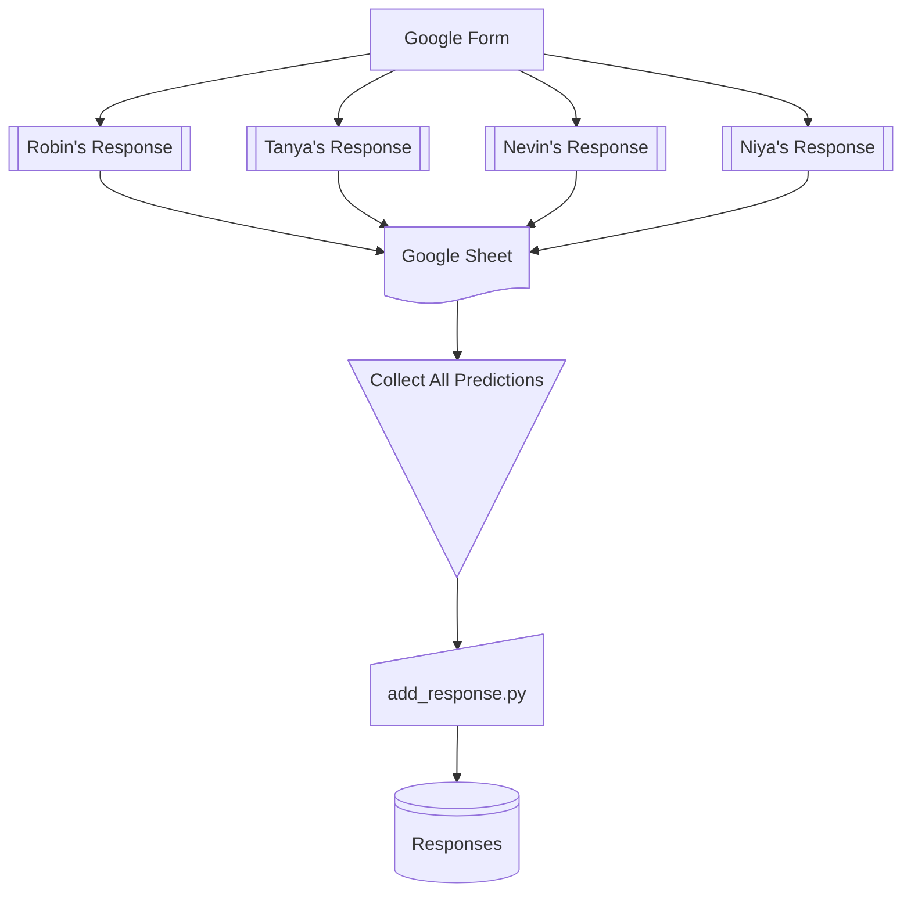

# Workflow
## Google Forms to Database

```mermaid
flowchart TD
    A[Google Form] --> B["Robin's Response"]@{shape: fr-rect}
    A --> C["Tanya's Response"]@{shape: fr-rect}
    A --> D["Nevin's Response"]@{shape: fr-rect}
    A --> E["Niya's Response"]@{shape: fr-rect}
    B --> F["Google Sheet"]@{shape: doc}
    C --> F
    D --> F
    E --> F
    Collect["Collect All Predictions"]@{shape: flip-tri}
    F --> Collect
    response["add_response.py"]@{shape: sl-rect}
    Collect --> response
    database["Responses"]@{shape: lin-cyl}
    response --> database
```